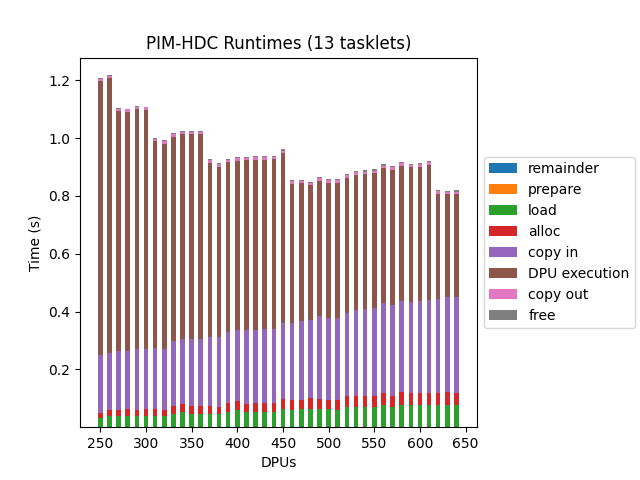
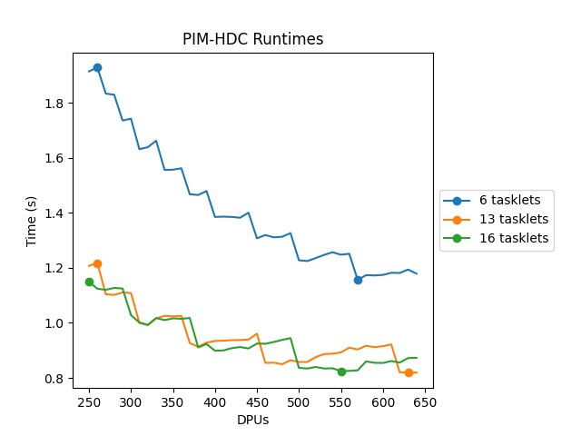

# Chartgen

## Summary

Given a CSV with:

```csv
Host,DPU,PREPARE,DPU_LOAD,DPU_ALLOC,COPY_IN,DPU_RUN,COPY_OUT,DPU_FREE,NR_TASKLETS,NR_DPUS
```

Generate a runtime vs DPU line or bar chart.

## Usage

```txt
usage: runtimechart.py [-h] --csvfile CSVFILE [--xlabel XLABEL] [--ylabel YLABEL] [--xstepsize XSTEPSIZE] [--ystepsize YSTEPSIZE]
                       [--title TITLE] [--nohost] [--outputfile OUTPUTFILE] [--type TYPE] [--includetasklet INCLUDETASKLET]

Generate a runtime chart for PIM-HDC

optional arguments:
  -h, --help            show this help message and exit
  --csvfile CSVFILE     Input CSV data file
  --xlabel XLABEL       Chart x-axis label
  --ylabel YLABEL       Chart y-axis label
  --xstepsize XSTEPSIZE
                        Chart x-axis stepsize
  --ystepsize YSTEPSIZE
                        Chart y-axis stepsize
  --title TITLE         Chart title
  --nohost              Do not include host
  --outputfile OUTPUTFILE
                        Output chart
  --type TYPE           Chart type (splitbar or line)
  --includetasklet INCLUDETASKLET
                        Include tasklets

```

## Examples

Bar:

```shell script
python3 runtimechart.py --csvfile run.csv.example \
                        --nohost --type bar \
                        --includetasklet 13
                        --title "PIM-HDC Runtimes (13 tasklets)"
```




Line:

```shell script
python3 runtimechart.py --csvfile run.csv.example \
                        --nohost --type line \
                        --includetasklet 6 \
                        --includetasklet 13 \
                        --includetasklet 16 \
                        --title "PIM-HDC Runtimes (13 tasklets)"
```


