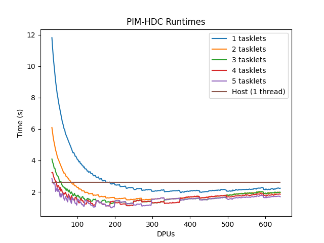

# Chartgen

## Summary

Given a CSV with:

```csv
Host,DPU,NR_TASKLETS,NR_DPUS
```

Generate a runtime vs DPU chart.

## Usage

```txt
usage: runtimechart.py [-h] --csv_file CSV_FILE [--xlabel XLABEL] [--ylabel YLABEL] [--title TITLE] [--output_file OUTPUT_FILE]

Generate a runtime chart for PIM-HDC

optional arguments:
  -h, --help            show this help message and exit
  --csv_file CSV_FILE   Input CSV data file
  --xlabel XLABEL       Chart x-axis label
  --ylabel YLABEL       Chart y-axis label
  --title TITLE         Chart title
  --output_file OUTPUT_FILE
                        Output chart
```

## Example

```shell script
python runtimechart.py --csv_file run.csv.example
```


